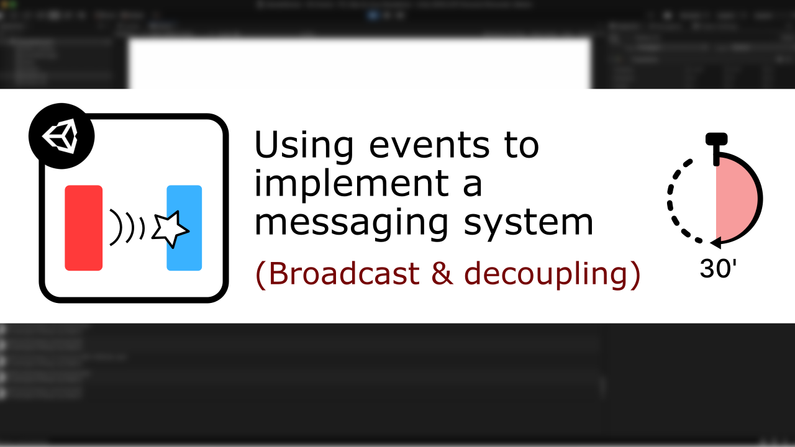
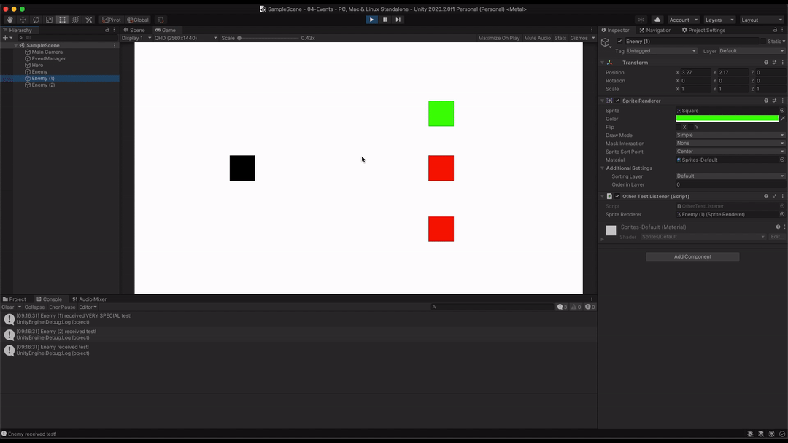

# [Unity/C#] Events & Broadcasting

**Mina Pêcheux - July 2021**

How can we use Unity's built-in events and actions to implement a simple broadcast messaging system? Let's discover more in this 30 minutes-tutorial: "How to use events to implement a messaging system in 30 minutes".

It's available in text/video format: you can read it [on Medium](https://medium.com/geekculture/how-to-use-events-to-implement-a-messaging-system-in-unity-c-342ab4806d53) or watch it [on Youtube](https://www.youtube.com/watch?v=EvqdcyTgZNg).

In this tutorial, I'm discussing the power of events for decoupling your game systems and better organising projects. We're looking at the emitters and receivers system (with one or multiple event types), at how to convey data with your events and at how to react differently to the same event depending on the listener.

This Github repo contains the code that is written throughout the tutorial:

- the main `EventManager` C# class
- a test emitter that triggers events on left- or right-mouse buttons click
- some test listeners that react differently to those events

